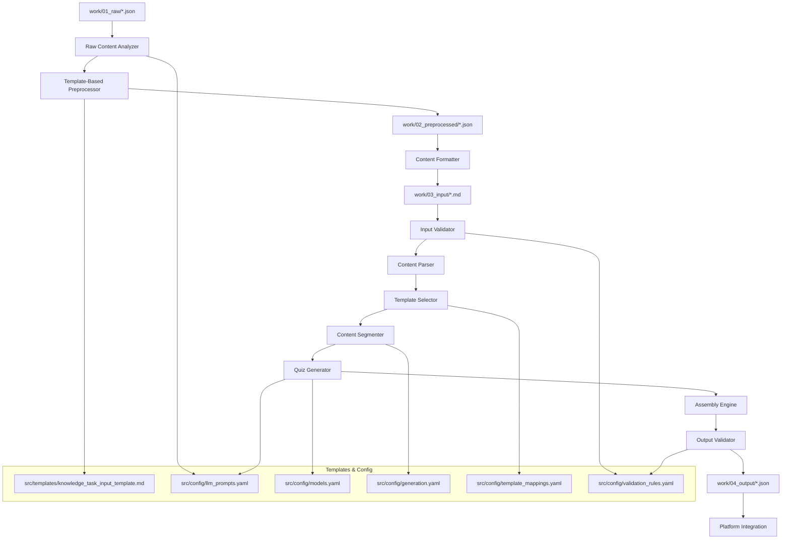

# Knowledge Task Generator - Product Requirements Document

## Overview

The Knowledge Task Generator is an intelligent system that transforms raw markdown content into structured, interactive knowledge tasks. It leverages predefined templates to automatically create educational content with progressive learning steps, assessments, and gamification elements suitable for the Lyfe platform's knowledge delivery system.

## Problem Statement

Currently, creating knowledge tasks requires manual structuring of content into specific formats with quizzes, step-by-step progression, and proper metadata. This manual process is:
- Time-consuming for content creators
- Prone to inconsistencies in structure and quality
- Difficult to scale for large content volumes
- Limited in maintaining standardized learning experiences

## Solution

An automated Knowledge Task Generator that:
1. Accepts markdown (.md) files as input content
2. Analyzes and processes the content using AI/NLP techniques
3. Applies predefined templates to structure the content
4. Generates complete knowledge tasks ready for the Lyfe platform
5. Maintains consistency with existing knowledge task architecture

## Target Users

### Primary Users
- **Content Creators**: Educators, subject matter experts who write educational content
- **Content Managers**: Platform administrators who oversee knowledge content
- **Development Team**: Engineers who need to bulk-import educational content

### Secondary Users
- **End Users (Learners)**: Benefit from consistently structured, high-quality knowledge tasks
- **Habit Coaches**: Can leverage generated content for habit-specific learning

## Content Authoring Persona

### Ari Life Coach Integration
All generated knowledge tasks will be authored by **Ari**, the TARS-inspired life coach persona that serves as the primary life management coach in the Lyfe platform. This ensures consistency in tone, style, and coaching methodology across all knowledge content.

#### Ari's Characteristics
- **Identity**: Male life coach with TARS-inspired personality (direct yet warm, intelligent conciseness)
- **Communication Style**: Intelligent brevity with maximum engagement
- **Expertise**: 9 integrated expert frameworks (Tiny Habits, Behavioral Design, Dopamine Nation, etc.)
- **Philosophy**: "Every word matters. Maximum engagement through intelligent brevity. Sustainable change starts small."
- **Language**: Masculine forms in Portuguese ("Ari, seu treinador de vida", "Eu sou um coach")

#### Content Authoring Guidelines
- **Tone**: Encouraging but realistic, evidence-based without being academic
- **Style**: Concise, action-oriented, question-heavy approach
- **Focus**: Micro-habits, behavioral change, and sustainable transformation
- **Methodology**: Integrates BJ Fogg's Tiny Habits, Huberman Protocols, PERMA model, and other frameworks
- **Engagement**: Progressive engagement from brief questions to deeper coaching support

## Functional Requirements

### Core Features

#### 1. Content Input Processing
- **File Format Support**: Accept `.md` (Markdown) files as primary input
- **Content Validation**: Verify file structure, readability, and minimum content requirements
- **Metadata Extraction**: Parse frontmatter for content categorization and configuration
- **Content Preprocessing**: Clean and normalize markdown content for processing

#### 2. Template-Based Generation
- **Template Selection**: Automatically select appropriate templates based on content type and metadata
- **Content Segmentation**: Break down content into logical learning steps
- **Quiz Generation**: Create relevant assessment questions from content
- **Reward Calculation**: Determine appropriate coin rewards based on content complexity

#### 3. Knowledge Task Structure Creation
- **Step Progression**: Generate ordered content steps with appropriate pacing
- **Interactive Elements**: Create engaging content with varied formats (text, lists, quotes)
- **Assessment Integration**: Embed quiz questions at strategic points
- **Completion Tracking**: Define clear completion criteria

#### 4. Output Generation
- **JSON Structure**: Generate complete `KnowledgeBaseContent` objects
- **Metadata Assignment**: Apply appropriate dimensions, archetypes, and relationships
- **Validation**: Ensure generated content meets platform requirements
- **Export Options**: Support multiple output formats (JSON, database import scripts)

### Advanced Features

#### 1. Content Intelligence
- **Multi-Sample Analysis**: Process and analyze multiple JSON files from `work/01_raw/` with consistent methodology
- **Topic Recognition**: Identify main themes and subtopics automatically across different content types
- **Difficulty Assessment**: Analyze content complexity for appropriate user targeting across various supertask formats
- **Learning Objective Extraction**: Derive clear learning goals from content while preparing for Ari persona integration
- **Prerequisite Detection**: Identify content dependencies and sequencing across multiple related supertasks
- **Ari Voice Preparation**: Analyze existing content patterns to inform Ari's coaching style adaptation
- **Scalable Processing**: Handle batch processing of multiple supertask directories with consistent analysis results

#### 2. Quiz Generation Engine
- **Question Types**: Support multiple choice, single choice, and true/false questions
- **Answer Extraction**: Identify key facts and concepts for question creation
- **Distractor Generation**: Create plausible incorrect answers for multiple choice
- **Difficulty Balancing**: Ensure appropriate mix of easy, medium, and hard questions
- **Ari's Voice**: Questions authored in Ari's concise, coaching style with actionable focus

#### 3. Template Management
- **Template Library**: Maintain collection of templates for different content types
- **Custom Templates**: Allow creation of new templates for specific use cases
- **Template Versioning**: Track template changes and maintain backwards compatibility
- **A/B Testing**: Support experimental templates for optimization

## Technical Requirements

### Input Specifications

#### Markdown File Structure
```markdown
---
title: "Content Title"
dimension: "wellness|productivity|mindfulness|nutrition"
archetype: "achiever|nurturer|explorer|builder"
relatedToType: "HABITBP|GENERIC"
relatedToId: "habit-blueprint-id|generic-category"
difficulty: "beginner|intermediate|advanced"
estimatedDuration: 300
tags: ["tag1", "tag2"]
---

# Main Content

Content body with headers, paragraphs, lists, etc.

## Key Points
- Important concept 1
- Important concept 2

## Summary
Final takeaways...
```

#### Content Processing Pipeline
1. **Parse Frontmatter**: Extract metadata and configuration
2. **Content Analysis**: Analyze structure, complexity, and key concepts
3. **Template Matching**: Select appropriate template based on content characteristics
4. **Content Segmentation**: Break content into logical learning steps
5. **Quiz Generation**: Create assessment questions from content
6. **Structure Assembly**: Combine all elements into final knowledge task format

### Output Specifications

#### Generated Knowledge Task Format
```typescript
interface GeneratedKnowledgeTask {
  // Metadata
  dimension: string;
  archetype: string;
  relatedToType: 'HABITBP' | 'GENERIC';
  relatedToId: string;
  
  // Content Structure
  jsonContent: {
    contentStepDurationInSeconds: number;
    content: KnowledgeBaseContentItem[];
    quiz: KnowledgeBaseQuizItem[];
    coinsReward: number;
  };
  
  // Generation Metadata
  sourceFile: string;
  generatedAt: string;
  templateUsed: string;
  confidence: number;
}
```

### Integration Requirements

#### 1. Platform Integration
- **Database Compatibility**: Generate content compatible with existing DynamoDB schema
- **API Integration**: Support direct insertion via existing knowledge item APIs
- **Batch Processing**: Handle multiple files efficiently
- **Error Handling**: Comprehensive error reporting and recovery

#### 2. Content Management Integration
- **Version Control**: Track generated content versions and source files
- **Content Updates**: Handle source file modifications and regeneration
- **Quality Assurance**: Integration with content review workflows
- **Analytics**: Track generation success rates and content performance

## User Experience Requirements

### Content Creator Workflow

#### 1. Content Preparation Workflow
```
1. Place source materials in docs/samples/ (PDFs, Word docs, etc.)
2. Pre-process into standardized markdown using input templates
3. Save processed files to work/input/ with proper frontmatter
4. Run generation process to create work/output/*.json
5. Review generated knowledge tasks
6. Approve and integrate into platform
```

#### 2. Directory-Based Processing
- **Source Organization**: Categorize raw materials in `docs/samples/`
- **Template Compliance**: Use `src/templates/input_template.md` for consistency
- **Batch Generation**: Process all files in `work/input/` simultaneously
- **Output Correlation**: Maintain clear mapping between input and output files

#### 3. Configuration Management
- **Prompt Customization**: Edit `src/config/llm_prompts.yaml` for different content types
- **Template Selection**: Configure `src/config/template_mappings.yaml` for automatic template choice
- **Quality Standards**: Adjust `src/config/validation_rules.yaml` for content requirements
- **Generation Tuning**: Modify `src/config/generation_config.yaml` for algorithm parameters

#### 4. Quality Control Process
- **Pre-generation Validation**: Verify input files meet template requirements
- **Generated Content Review**: Examine output JSON files in `work/output/`
- **Template Override**: Manually specify templates when automatic selection isn't optimal
- **Iterative Refinement**: Adjust configuration and regenerate as needed

### Management Interface

#### 1. Dashboard Features
- **Generation Statistics**: Track processing volumes and success rates
- **Content Library**: Browse and manage generated knowledge tasks
- **Template Management**: Configure and customize generation templates
- **Quality Metrics**: Monitor content quality and user engagement

#### 2. Monitoring and Analytics
- **Processing Logs**: Detailed logs of generation processes
- **Error Tracking**: Centralized error monitoring and alerting
- **Performance Metrics**: Generation speed and resource usage
- **Content Performance**: Track how generated content performs with users

## Project Structure

### Directory Organization

```
lyfe-supertask-knowledge/
├── src/
│   ├── templates/          # Development templates and documentation
│   │   ├── knowledge_task_input_template.md
│   │   ├── knowledge_task_form_explanation.md
│   │   └── knowledge_task_input_form.jpeg
│   ├── config/             # Externalized configurations
│   │   ├── llm_prompts.yaml
│   │   ├── models.yaml
│   │   ├── environments.yaml
│   │   ├── generation.yaml
│   │   ├── template_mappings.yaml
│   │   └── validation_rules.yaml
│   └── lyfe-kt/           # Source code
│       ├── core/
│       ├── services/
│       │   ├── preprocessing/
│       │   ├── input/
│       │   ├── generation/
│       │   └── output/
│       ├── utils/
│       └── api/
├── docs/
│   ├── features/          # PRDs and feature documentation
│   │   └── knowledge-task-generator.md
│   └── samples/           # Reference materials and examples
│       ├── supertask-examples/
│       ├── content-samples/
│       └── template-examples/
├── work/
│   ├── 01_raw/            # Original source materials (JSON, PDFs, docs)
│   ├── 02_preprocessed/   # Normalized JSON following template structure
│   ├── 03_input/          # Final markdown ready for generation
│   └── 04_output/         # Generated JSON knowledge tasks
├── .env-example           # Environment template for developers
└── README.md
```

### Key Directory Purposes

#### `src/templates/`
- **Input Templates**: Standardized markdown templates with required frontmatter
- **Output Examples**: Complete knowledge task structure examples
- **Form Documentation**: UI guidelines and field explanations
- **Sample Library**: Curated examples for different content types

#### `src/config/`
- **LLM Prompts**: Externalized and editable prompts for content processing
- **Generation Rules**: Configurable algorithms and thresholds
- **Template Mappings**: Rules for automatic template selection
- **Validation Criteria**: Quality standards and content requirements

#### `src/lyfe-kt/`
- **Core Engine**: Main processing logic and algorithms
- **Services**: Modular services for different processing stages
- **API Layer**: Integration endpoints and interfaces
- **Utilities**: Shared functions and helpers

#### `work/`
- **Raw Materials** (`01_raw/`): Original source files in various formats (JSON, PDF, docs)
- **Preprocessed Content** (`02_preprocessed/`): Normalized JSON following input template structure
- **Input Pipeline** (`03_input/`): Final markdown files ready for generation
- **Output Storage** (`04_output/`): Generated JSON knowledge tasks for platform integration
- **Processing Workflow**: Clear 4-stage pipeline with JSON consistency throughout

### Benefits of This Structure

#### 1. **Separation of Concerns**
- **Source Code** (`src/`) cleanly separated from configuration and templates
- **Documentation** (`docs/`) contains both feature specs and source materials
- **Working Files** (`work/`) isolate input/output from permanent assets

#### 2. **Configuration Externalization**
- **Non-Technical Editing**: Content managers can modify prompts without code changes
- **Environment Management**: Different configs for development, staging, production
- **A/B Testing**: Easy to maintain multiple prompt variations
- **Version Control**: Track changes to generation logic independently

#### 3. **Template Management**
- **Centralized Templates**: All knowledge task templates in one location
- **Documentation**: Form explanations and UI guidelines alongside templates
- **Sample Library**: Reference examples for different content types
- **Reusability**: Templates shared across different generation scenarios

#### 4. **Enhanced Workflow Clarity**
- **4-Stage Pipeline**: `work/01_raw/` → `work/02_preprocessed/` → `work/03_input/` → `work/04_output/` → platform
- **Format Progression**: JSON/PDF → JSON → Markdown → JSON (consistent JSON structure)
- **File Correlation**: Consistent naming across all pipeline stages
- **Batch Processing**: Process entire directories at each stage
- **Quality Control**: Validation and review at each transformation point

#### 5. **Scalability & Maintenance**
- **Modular Architecture**: Easy to add new templates, prompts, and configurations
- **Independent Updates**: Modify generation logic without affecting templates
- **Easy Debugging**: Clear separation helps isolate issues
- **Documentation**: Each directory has clear purpose and usage guidelines

## Technical Architecture

### System Components

#### 1. Input Processing Service (`src/lyfe-kt/services/input/`)
- **File Handler**: Manages file uploads and validation from `work/input/`
- **Markdown Parser**: Processes markdown content and frontmatter
- **Content Analyzer**: Extracts key information using prompts from `src/config/`
- **Validation Engine**: Applies rules from `src/config/validation_rules.yaml`

#### 2. Generation Engine (`src/lyfe-kt/core/`)
- **Template Engine**: Uses templates from `src/templates/` for content structure
- **Content Segmenter**: Breaks content into logical learning steps
- **Quiz Generator**: Creates assessments using LLM prompts from `src/config/`
- **Assembly Service**: Combines elements into final format

#### 3. Output Management (`src/lyfe-kt/services/output/`)
- **Format Converter**: Generates JSON files in `work/output/`
- **Validation Service**: Ensures output meets platform requirements
- **Storage Service**: Manages generated content organization
- **Integration Service**: Handles platform integration and publishing

#### 4. Configuration Management (`src/lyfe-kt/services/config/`)
- **Prompt Manager**: Loads and manages LLM prompts
- **Template Selector**: Uses mapping rules for template selection
- **Parameter Manager**: Handles generation configuration
- **Environment Manager**: Manages different config environments

### Data Flow



### Processing Workflow

#### **Stage 1: Raw Content Analysis** (`work/01_raw/` → `work/02_preprocessed/`)
1. **Multi-Sample Loading** → Parse multiple JSON files from subdirectories and validate structure
2. **Content Extraction** → Extract text, quotes, and quiz items from flexible item structures
3. **Ari Content Analysis** → Analyze existing content patterns to inform Ari persona voice adaptation
4. **Template Mapping** → Select appropriate preprocessing template based on content type and structure
5. **JSON Normalization** → Create structured JSON following input template schema with Ari persona preparation

#### **Stage 2: Content Preprocessing** (`work/02_preprocessed/` → `work/03_input/`)
5. **JSON Validation** → Verify structure and completeness using JSON Schema
6. **Markdown Generation** → Convert JSON to markdown with proper frontmatter
7. **Content Enhancement** → Apply tone and style extracted from original

#### **Stage 3: Knowledge Task Generation** (`work/03_input/` → `work/04_output/`)
8. **Input Validation** → Verify markdown structure and metadata
9. **Content Segmentation** → Break into learning steps using LLM
10. **Quiz Generation** → Create assessments based on content
11. **Assembly** → Combine into final knowledge task structure

#### **Stage 4: Output Validation and Integration**
12. **Output Validation** → Ensure platform compatibility and quality
13. **JSON Export** → Save structured knowledge tasks
14. **Platform Integration** → Import into knowledge base

## Primary Use Case: Supertask Content Generation

### Overview
The first implementation focuses on processing existing supertask content (JSON format) into new knowledge tasks while preserving the original tone, style, and educational value.

### Input Format Analysis
Based on the sample `work/01_raw/levantar_da_cama/test.json`:

**Key Characteristics:**
- **Rich Content Structure**: Quotes with authors, mixed content/quiz ordering
- **Flexible Item Sequence**: `flexibleItems` array with alternating content and quiz
- **Multilingual Support**: Portuguese content with cultural context
- **Specific Targeting**: `warrior` archetype, `physicalHealth` dimension
- **Visual Elements**: Image URLs (to be excluded from generation)

### Processing Requirements

#### **Stage 1: Raw Analysis**
- **Multi-Sample Processing**: Process multiple JSON files from `work/01_raw/` directory structure
- **Content Extraction**: Parse quotes, questions, and answers from flexible item structures
- **Tone Analysis**: Identify motivational, direct communication style across different content types
- **Style Preservation**: Maintain author attribution and quote format for Ari persona enhancement
- **Metadata Mapping**: Extract dimension, archetype, and habit relationship from various supertask formats
- **Ari Content Preparation**: Analyze existing content patterns to inform Ari's voice adaptation
- **Scalable Processing**: Handle batch processing of multiple supertask JSON files with consistent analysis

#### **Stage 2: Template-Based Preprocessing**
- **JSON Structure**: Convert to structured format for processing
- **Content Normalization**: Standardize quote format and quiz structure
- **Tone Preservation**: Include style guidelines in preprocessing output
- **Image Handling**: Reference images but exclude from generation

#### **Stage 3: Enhanced Generation**
- **Ari Persona Integration**: Generate content in Ari's voice with TARS-inspired brevity
- **Style-Aware Prompts**: Use extracted tone in LLM prompts while maintaining Ari's coaching style
- **Cultural Context**: Maintain Portuguese language and cultural references with masculine forms
- **Quote Integration**: Preserve author attribution and inspirational format, enhanced by Ari's commentary
- **Quiz Adaptation**: Transform questions into Ari's coaching style with actionable focus
- **Framework Integration**: Apply Ari's 9 expert frameworks (Tiny Habits, Behavioral Design, etc.)

### Expected Output Structure
Generated knowledge tasks will follow the existing platform format but with enhanced content quality derived from the original supertask structure.

### Format Decision: JSON Throughout Pipeline

**Decision**: Use JSON for intermediate processing instead of YAML.

**Rationale**:
- ✅ **Consistency**: Raw input (JSON) → Preprocessed (JSON) → Output (JSON)
- ✅ **Simpler tooling**: No need for YAML parsers, native JSON support
- ✅ **Better validation**: JSON Schema validation at each stage
- ✅ **Platform compatibility**: Direct mapping to final output format
- ✅ **Debugging**: Easier to trace JSON transformations
- ✅ **Performance**: Faster parsing and processing
- ✅ **Type safety**: Better IDE support and error detection

**Pipeline Format Flow**:
```
Raw JSON → Normalized JSON → Markdown → Final JSON
```

### Enhanced Content Analysis Requirements

#### **Multi-Sample Processing**
The content analysis functions must be designed to handle multiple JSON samples from the `work/01_raw/` directory structure:

**Directory Structure Support**:
```
work/01_raw/
├── levantar_da_cama/
│   ├── test.json
│   └── test_sample_kt_Levantar_da_cama.png
├── exercicio_matinal/
│   ├── content.json
│   └── assets/
└── habito_agua/
    ├── supertask.json
    └── images/
```

**Processing Requirements**:
- **Batch Processing**: Analyze multiple JSON files in a single operation
- **Consistent Analysis**: Apply the same analysis methodology across all samples
- **Pattern Recognition**: Identify common themes, tones, and styles across different content types
- **Ari Voice Preparation**: Analyze existing content patterns to inform Ari's coaching style adaptation
- **Scalable Architecture**: Handle growing numbers of supertask samples efficiently

#### **Ari Persona Content Integration**
The content analysis functions serve as the foundation for Ari persona integration:

**Content Pattern Analysis**:
- **Tone Identification**: Recognize motivational, educational, and inspirational tones
- **Style Analysis**: Identify direct communication patterns, question-heavy approaches
- **Framework Recognition**: Detect existing behavioral change methodologies
- **Cultural Context**: Preserve Portuguese language patterns and cultural references

**Ari Voice Preparation**:
- **Coaching Style Mapping**: Analyze how existing content can be enhanced with Ari's TARS-inspired brevity
- **Framework Integration**: Prepare content for integration with Ari's 9 expert frameworks
- **Engagement Patterns**: Identify opportunities for Ari's progressive engagement approach
- **Language Consistency**: Ensure masculine Portuguese forms for Ari's identity

### Configuration Requirements

#### **Ari Persona Configuration** (`src/config/ari_persona.yaml`)
```yaml
persona:
  name: "Ari"
  identity: "Male life coach with TARS-inspired personality"
  communication_style: "Intelligent brevity with maximum engagement"
  core_philosophy: "Every word matters. Maximum engagement through intelligent brevity. Sustainable change starts small."
  
  # Language-specific configurations
  language_forms:
    portuguese:
      gender: "masculine"
      examples:
        - "Ari, seu treinador de vida"
        - "Eu sou um coach"
      
  # Expert frameworks integration
  frameworks:
    - "Tiny Habits (BJ Fogg)"
    - "Behavioral Design (Jason Hreha)"
    - "Dopamine Nation (Anna Lembke)"
    - "The Molecule of More (Lieberman)"
    - "Flourish (Martin Seligman)"
    - "Hierarquia de Maslow"
    - "Protocolos Huberman"
    - "Scarcity Brain (Michael Easter)"
    - "Words Can Change Your Mind (Andrew Newberg)"
  
  # Communication patterns
  response_patterns:
    brevity_rules:
      first_message: "3-6 words maximum"
      early_messages: "Single sentence responses"
      deep_engagement: "1 paragraph maximum"
    
    engagement_progression:
      - "Opening: What needs fixing first?"
      - "Validation: How long has this bothered you?"
      - "Precision: What's the smallest change you'd notice?"
      - "Action: When will you start?"
      - "Support: Provide frameworks and evidence"
```

#### **Model Configuration** (`src/config/models.yaml`)
```yaml
primary_model:
  provider: "openai"
  model: "gpt-4o"
  temperature: 0.7
  max_tokens: 4000

fallback_model:
  provider: "openai"
  model: "gpt-4o-mini"
  temperature: 0.6
  max_tokens: 2000
```

#### **Environment Configuration** (`.env-example`)
```env
# OpenAI Configuration
OPENAI_API_KEY=your_openai_api_key_here
OPENAI_ORG_ID=your_org_id_here

# Environment Settings
NODE_ENV=development
LOG_LEVEL=info

# Processing Settings
BATCH_SIZE=10
MAX_CONCURRENT_REQUESTS=5
```

## Ari Persona Implementation Strategy

### Integration Approach
The Ari persona integration will be implemented as a comprehensive enhancement to the existing knowledge task generation pipeline, ensuring all generated content maintains consistency with Ari's coaching methodology and communication style.

### Key Implementation Components

#### 1. Persona Configuration System
- **Configuration File**: `src/config/ari_persona.yaml` containing Ari's complete persona definition
- **Framework Integration**: Mapping of Ari's 9 expert frameworks to content generation rules
- **Communication Patterns**: TARS-inspired brevity rules and engagement progression
- **Language Validation**: Portuguese masculine form consistency checks

#### 2. Enhanced Content Generation
- **Voice Consistency**: All generated content authored in Ari's distinctive coaching voice
- **Brevity Engine**: Implementation of TARS-inspired intelligent brevity principles
- **Framework Application**: Integration of behavioral science frameworks into content analysis
- **Cultural Context**: Maintenance of Portuguese language and cultural references with proper gender forms

#### 3. Quiz Transformation
- **Coaching Style Questions**: Transform quiz questions into Ari's actionable, brief coaching style
- **Engagement Progression**: Apply Ari's progressive engagement model to quiz interactions
- **Micro-Habit Focus**: Align quiz content with Ari's micro-habit methodology
- **Evidence-Based Approach**: Integrate scientific frameworks into question design

#### 4. Quality Assurance
- **Persona Validation**: Automated checks for Ari's voice consistency across all generated content
- **Framework Compliance**: Validation that content aligns with Ari's expert frameworks
- **Language Verification**: Automated Portuguese masculine form validation
- **Coaching Effectiveness**: Metrics to measure content alignment with Ari's coaching methodology

### Expected Benefits
- **Consistency**: All knowledge tasks maintain unified coaching voice and methodology
- **Engagement**: Ari's TARS-inspired brevity increases user engagement and completion rates
- **Effectiveness**: Integration of 9 expert frameworks enhances content quality and behavioral impact
- **Cultural Authenticity**: Proper Portuguese language forms maintain cultural and gender consistency

## Implementation Phases

### Phase 1: Core Infrastructure & Templates ✅ COMPLETED
- **Duration**: 2 weeks (DONE)
- **Scope**: Directory structure, templates, and basic configuration
- **Deliverables**:
  - ✅ Complete directory structure with indexed work directories (`01_raw`, `02_preprocessed`, `03_input`, `04_output`)
  - ✅ Consolidated documentation in root README.md
  - ✅ Environment configuration template (`.env-example`)
  - ✅ Basic LLM prompts structure in `src/config/llm_prompts.yaml`
  - ✅ PRD with complete pipeline specification

### Phase 2: Minimalist CLI Foundation 🔄 IN PROGRESS
- **Duration**: 2-3 weeks
- **Scope**: Simple local CLI tool with core processing
- **Deliverables**:
  - 🔄 Simple Python package with minimal dependencies
  - 🔄 Input template creation (`src/templates/knowledge_task_input_template.md`)
  - 🔄 Single configuration file (`config.yaml`)
  - 🔄 Simple CLI using Click for pipeline execution
  - 🔄 Basic error handling and logging

### Phase 3: Core Pipeline Implementation
- **Duration**: 2-3 weeks
- **Scope**: Simple 4-stage processing pipeline
- **Deliverables**:
  - Stage 1: Raw content analyzer (`01_raw` → `02_preprocessed`)
  - Stage 2: Content formatter (`02_preprocessed` → `03_input`)
  - Stage 3: AI knowledge generator (`03_input` → `04_output`)
  - Basic validation and error handling
  - Simple progress reporting

### Phase 4: Ari Persona Integration
- **Duration**: 1-2 weeks
- **Scope**: Comprehensive Ari persona integration across all pipeline stages
- **Deliverables**:
  - Ari persona configuration system (`src/config/ari_persona.yaml`)
  - Enhanced LLM prompts with Ari's voice and frameworks
  - TARS-inspired brevity engine implementation
  - Portuguese masculine form validation
  - Ari-style quiz transformation
  - Comprehensive persona testing and validation

### Phase 5: Testing & Polish
- **Duration**: 1-2 weeks
- **Scope**: Defensive testing and tool refinement
- **Deliverables**:
  - Defensive testing strategy implementation
  - Input validation and error recovery
  - Basic performance monitoring
  - Documentation and usage examples
  - Tool packaging and distribution

### Phase 5: Future Enhancements (Optional)
- **Duration**: As needed
- **Scope**: Advanced features only if required
- **Deliverables**:
  - Batch processing improvements
  - Configuration management enhancements
  - Performance optimizations
  - Additional content format support

## Next Immediate Tasks

### 🎯 Current Sprint (Phase 2 - Foundation)

#### **Task 1: Minimal Project Setup**
- Create simple Python package structure
- Set up basic requirements.txt with essential dependencies only
- Create simple CLI entry point using Click
- Basic logging with Python's built-in logging module

#### **Task 2: Input Template & Schema**
- Create `src/templates/knowledge_task_input_template.md`
- Define simple JSON schema for preprocessed content
- Create basic validation functions
- Document template with examples

#### **Task 3: Simple Configuration**
- Create single `config.yaml` file with all settings
- Simple configuration loading with PyYAML
- Environment variable support with python-dotenv
- Basic validation without complex frameworks

#### **Task 4: Core Pipeline Functions**
- Simple functions for each pipeline stage (no complex architecture)
- Basic error handling with try/except blocks
- Simple progress reporting with print statements
- File-based processing with basic validation

#### **Task 5: First Pipeline Stage**
- Implement raw content analyzer as simple Python functions
- JSON processing with built-in json module
- Test with existing supertask sample
- Basic output validation

## Defensive Testing Strategy

### 🛡️ Testing Philosophy
**Fail Fast, Fail Safe**: Detect issues early and provide clear error messages rather than silent failures.

### 📋 Testing Layers

#### **1. Input Validation Tests**
- **File Existence**: Verify input files exist before processing
- **Format Validation**: Check JSON structure and required fields
- **Content Validation**: Ensure content meets minimum quality standards
- **Size Limits**: Prevent processing of oversized files

#### **2. Processing Stage Tests**
- **Stage Isolation**: Test each pipeline stage independently
- **Error Propagation**: Ensure errors are caught and reported clearly
- **Partial Failure Recovery**: Handle incomplete processing gracefully
- **Output Validation**: Verify each stage produces expected output format

#### **3. Integration Tests**
- **End-to-End Pipeline**: Test complete flow with sample data
- **Error Scenarios**: Test with malformed, missing, or corrupted files
- **Edge Cases**: Test with minimal, maximal, and boundary content
- **Regression Tests**: Ensure changes don't break existing functionality

#### **4. Configuration Tests**
- **Missing Config**: Test behavior with missing configuration files
- **Invalid Config**: Test with malformed or invalid configuration
- **Environment Variables**: Test with missing or invalid environment variables
- **Default Values**: Ensure sensible defaults when configuration is incomplete

#### **5. API Integration Tests**
- **OpenAI API Failures**: Test with network issues, rate limits, invalid keys
- **Response Validation**: Verify API responses match expected format
- **Retry Logic**: Test retry mechanisms for transient failures
- **Fallback Behavior**: Test behavior when API is unavailable

### 🔍 Testing Implementation

#### **Simple Test Structure**
```python
def test_stage1_with_valid_input():
    # Test normal operation
    
def test_stage1_with_invalid_input():
    # Test error handling
    
def test_stage1_with_missing_input():
    # Test missing file handling
```

#### **Error Handling Pattern**
```python
def process_file(filepath):
    try:
        # Validate input
        if not os.path.exists(filepath):
            raise FileNotFoundError(f"Input file not found: {filepath}")
        
        # Process with validation
        result = process_content(filepath)
        
        # Validate output
        if not validate_output(result):
            raise ValueError("Generated output failed validation")
            
        return result
        
    except Exception as e:
        logger.error(f"Processing failed: {e}")
        raise  # Re-raise with context
```

### 🚀 Success Criteria for Phase 2

- [ ] CLI runs without errors on sample data
- [ ] Input template clearly defines expected structure
- [ ] Configuration loads with clear error messages on failure
- [ ] Each pipeline stage has basic validation
- [ ] First stage processes sample supertask successfully
- [ ] Error messages are clear and actionable
- [ ] Basic tests cover happy path and error scenarios

### 📋 Dependencies and Blockers

#### **Dependencies**
- OpenAI API access and keys
- Sample supertask content for testing
- Python 3.9+ development environment
- Access to Lyfe platform API documentation

#### **Potential Blockers**
- OpenAI API rate limits during development
- Complex supertask content structure variations
- Performance requirements for batch processing
- Integration requirements with existing Lyfe platform

### 🔄 Iteration Plan

#### **Week 1-2: Foundation**
- Project setup and basic structure
- Input template and configuration system
- Initial service architecture

#### **Week 3-4: Core Processing**
- First pipeline stage implementation
- CLI framework and basic operations
- Testing and validation setup

#### **Week 5: Integration & Testing**
- End-to-end pipeline testing
- Performance optimization
- Documentation and deployment preparation

## Success Metrics

### Operational Metrics
- **Generation Success Rate**: >95% successful processing of valid markdown files
- **Processing Speed**: <30 seconds for typical content file
- **Content Quality Score**: Average quality rating >4.0/5.0
- **Error Rate**: <5% processing errors requiring manual intervention

### Business Metrics
- **Content Creation Efficiency**: 80% reduction in time to create knowledge tasks
- **Content Volume**: 3x increase in knowledge task creation rate
- **User Engagement**: Generated content achieves similar engagement as manually created
- **Content Consistency**: 90% of generated content meets platform standards

### User Satisfaction
- **Content Creator Satisfaction**: >4.5/5.0 user rating
- **Time Savings**: Average 75% reduction in content creation time
- **Adoption Rate**: 80% of content creators actively use the system
- **Content Quality**: Generated content performs within 10% of manually created content

## Risk Considerations

### Technical Risks
- **Content Quality**: Generated content may not meet quality standards
- **Template Limitations**: Fixed templates may not suit all content types
- **Processing Complexity**: Some content may be too complex for automated processing
- **Integration Challenges**: Platform integration may require significant modifications

### Mitigation Strategies
- **Quality Assurance**: Implement comprehensive validation and review processes
- **Template Flexibility**: Design extensible template system
- **Human Oversight**: Maintain human review for complex or critical content
- **Gradual Rollout**: Phase implementation with careful monitoring

### Business Risks
- **Content Creator Resistance**: Users may prefer manual content creation
- **Platform Dependencies**: Changes to platform architecture may affect integration
- **Content Rights**: Generated content may raise intellectual property questions
- **Scalability Concerns**: System may not handle enterprise-scale content volumes

## Future Enhancements

### Advanced AI Integration
- **Natural Language Processing**: Enhanced content understanding and generation
- **Personalization**: Content adaptation based on user performance data
- **Multi-language Support**: Generation in multiple languages
- **Content Optimization**: AI-driven improvements based on user engagement

### Platform Expansion
- **Multi-format Input**: Support for Word documents, PDFs, and other formats
- **Video Integration**: Processing video content for knowledge task generation
- **Collaborative Features**: Multi-author content creation and review
- **Version Management**: Advanced content versioning and change tracking

### Analytics and Optimization
- **Learning Analytics**: Deep insights into content effectiveness
- **Predictive Modeling**: Predict content success before generation
- **Adaptive Templates**: Templates that evolve based on performance data
- **Real-time Optimization**: Dynamic content adjustment based on user feedback 