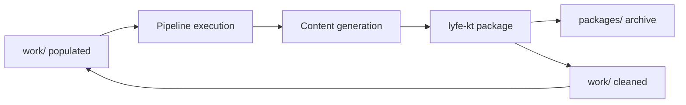

# Work Directory and Package System Guide

## 🗂️ Work Directory System

### **Purpose & Function**
The `work/` directory serves as the **active processing workspace** for the 3-stage pipeline. It maintains a standardized structure that mirrors the pipeline stages and gets cleaned after each project completion.

### **Work Directory Structure**
```bash
work/
├── 01_raw/                 # Stage 1 Input: Raw content files
│   ├── sample.md           # Markdown content
│   ├── document.pdf        # PDF files
│   ├── content.json        # JSON files
│   └── notes.txt           # Text files
├── 02_preprocessed/        # Stage 1 Output → Stage 3 Input
│   ├── *_filled_template.md     # Main preprocessed templates
│   ├── *_ari_analysis.json      # Ari persona analysis
│   └── *_oracle_context.json    # Oracle data context
├── 03_output/              # Stage 3 Output: Final JSON supertasks
│   ├── content_beginner.json    # Beginner difficulty
│   └── content_advanced.json    # Advanced difficulty
└── reports/                # Processing reports and logs
    ├── execution_logs.json
    └── pipeline_reports.md
```

### **Work Directory Lifecycle**

1. **Active Processing**: Files move through `01_raw/ → 02_preprocessed/ → 03_output/`
2. **Content Generation**: AI processes content at each stage
3. **Packaging**: Content gets archived to `packages/` when complete
4. **Cleanup**: Work directory is cleaned but structure preserved for next project

### **Usage Commands**
```bash
# Process content through pipeline stages
lyfe-kt preprocess work/01_raw/                    # Stage 1
lyfe-kt generate work/02_preprocessed/             # Stage 3

# Package completed work
lyfe-kt package                                    # Auto-detect title and package
```

---

## 📦 Package Directory System

### **Purpose & Function**
The `packages/` directory serves as **permanent archive storage** for completed projects. Each package represents a complete pipeline execution with all associated files, logs, and outputs.

### **Package Creation Process**

#### 1. **Auto-Title Detection**
```python
# ContentPackager.detect_title() logic:
# 1. Scan work/03_output/ for JSON files
# 2. Extract common prefix (e.g., "naval_supertask_01_beginner.json" → "naval_supertask")
# 3. Fallback to timestamp if no pattern: "content-2025-01-26"
```

#### 2. **Timestamped Package Creation**
```bash
# Format: <detected_title>-<YYYY-MM-DD-HH-MM>
packages/naval_supertask-2025-07-18-17-18/
packages/arthur_brooks_meaningful_life-2025-07-25-23-17/
packages/content-2025-07-24-2025-07-24-14-59/
```

#### 3. **Content Migration**
- **Copies** (doesn't delete) all content from `work/` to package
- **Preserves** complete directory structure
- **Includes** execution logs and processing reports
- **Maintains** audit trail for reproducibility

### **Package Directory Structure**
```bash
packages/naval_supertask-2025-07-18-17-18/
├── 01_raw/                          # Original input files
│   ├── NAVAL - How to Get Rich.pdf
│   ├── naval_concept_01_wealth_vs_money.md
│   ├── naval_concept_02_specific_knowledge.md
│   └── naval_wealth_concepts.md
├── 02_preprocessed/                 # Filled templates and analysis
│   ├── naval_concept_01_wealth_vs_money_filled_template.md
│   ├── naval_concept_01_wealth_vs_money_ari_analysis.json
│   ├── naval_concept_01_wealth_vs_money_oracle_context.json
│   └── naval_wealth_concepts_filled_template.md
├── 03_output/                       # Final platform-ready JSON
│   ├── naval_supertask_01_beginner.json
│   ├── naval_supertask_02_beginner.json
│   ├── naval_supertask_06_advanced.json
│   └── naval_supertask_10_advanced.json
├── reports/                         # Execution logs and analysis
│   ├── execution_log_2025-07-18-17-18-45.json
│   ├── pipeline_summary.md
│   └── quality_metrics.json
└── README.md                        # Package documentation
```

### **Package CLI Commands**
```bash
# Auto-detect title and package
lyfe-kt package
# Output: packages/naval_supertask-2025-01-26-14-30/

# Custom title
lyfe-kt package "my_custom_project"
# Output: packages/my_custom_project-2025-01-26-14-30/

# Custom output directory
lyfe-kt package --output-dir "archived_projects"

# Keep work directory after packaging
lyfe-kt package --keep-work
```

### **Package Features**

#### 🔍 **Smart Title Detection**
- Analyzes generated supertask files for common naming patterns
- Extracts meaningful project names from content
- Falls back to timestamp-based naming for generic content

#### 📋 **Complete Audit Trail**
- Execution logs with timestamps and session IDs
- Processing reports and quality metrics
- All intermediate files for reproducibility

#### 🧹 **Work Directory Cleanup**
```bash
# After packaging, work/ becomes:
work/
├── 01_raw/          # Empty but preserved
├── 02_preprocessed/ # Empty but preserved
├── 03_output/       # Empty but preserved
├── reports/         # Empty but preserved
└── README.md        # Kept for reference
```

#### 🔗 **Session Correlation**
- Links packages to specific pipeline execution sessions
- Enables tracking of content through complete lifecycle
- Supports batch processing and execution logging

---

## 🔄 Workflow Integration

### **Typical Usage Pattern**
```bash
# 1. Place content in work directory
cp content.md work/01_raw/

# 2. Run pipeline
lyfe-kt preprocess work/01_raw/
lyfe-kt generate work/02_preprocessed/

# 3. Package completed work
lyfe-kt package
# → Creates packages/content-2025-01-26-14-30/
# → Cleans work/ for next project

# 4. Start next project
cp new_content.md work/01_raw/
# → Ready for next pipeline run
```

### **Content Packaging Workflow**

#### **Automated Process**


#### **Manual Steps**
1. **Content Preparation**: Place raw files in `work/01_raw/`
2. **Pipeline Execution**: Run preprocessing and generation stages
3. **Quality Review**: Optionally review generated content
4. **Packaging**: Execute `lyfe-kt package` to archive results
5. **Workspace Reset**: Clean work directory ready for next project

### **Best Practices**

#### **Work Directory Management**
- Keep work directory focused on single project
- Review generated content before packaging
- Use descriptive filenames in `01_raw/`
- Leverage auto-title detection for consistent naming

#### **Package Organization**
- Use custom titles for important projects: `lyfe-kt package "quarterly_goals"`
- Keep packages for audit trail and reproducibility
- Archive old packages to external storage when needed
- Use `--keep-work` flag when iterating on content

#### **Error Recovery**
- Work directory preserves structure even after errors
- Packages are never overwritten (timestamp ensures uniqueness)
- Content is copied (not moved) to prevent data loss
- Session IDs enable correlation between logs and packages

---

## 🔧 Technical Implementation

### **ContentPackager Class**
```python
class ContentPackager:
    def __init__(self, work_dir="work", packages_dir="packages"):
        """Initialize with configurable directories."""
        
    def detect_title(self) -> str:
        """Auto-detect meaningful title from generated content."""
        
    def create_package(self, title: Optional[str] = None) -> str:
        """Create timestamped package directory."""
        
    def move_content(self, package_path: str):
        """Copy all work content to package folder."""
        
    def clean_work_directory(self):
        """Clean work directory while preserving structure."""
        
    def package_content(self, title=None, keep_work=False, session_id=None):
        """Complete packaging workflow with logging."""
```

### **CLI Integration**
```bash
# Command structure
lyfe-kt package [TITLE] [OPTIONS]

# Available options
--output-dir    # Custom package directory (default: packages/)
--keep-work     # Don't clean work directory after packaging
--session-id    # Manual session ID for log correlation
```

### **Benefits**
- **Organized**: Clear separation between active work and archived projects
- **Reproducible**: Complete audit trail for each package
- **Efficient**: Automated cleanup and organization
- **Scalable**: Handles multiple projects with timestamped organization
- **Safe**: Moves (doesn't delete) content to prevent data loss

This system enables efficient project management while maintaining complete traceability and organization of all generated content and processing artifacts. 